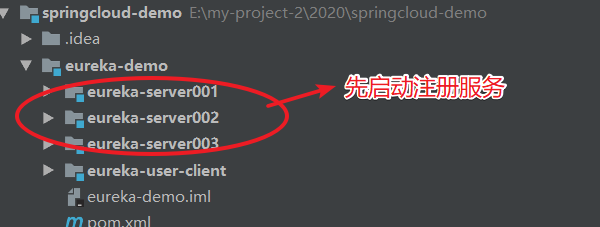
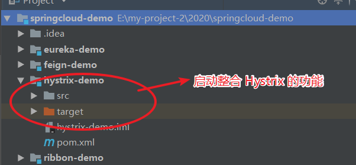
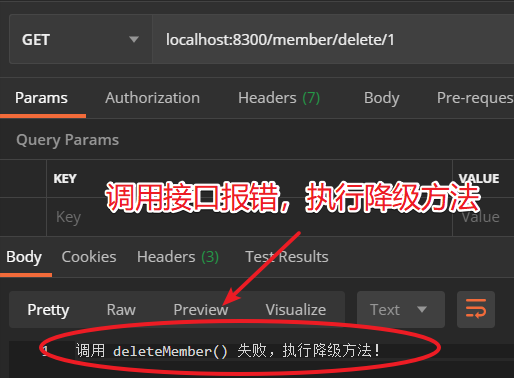
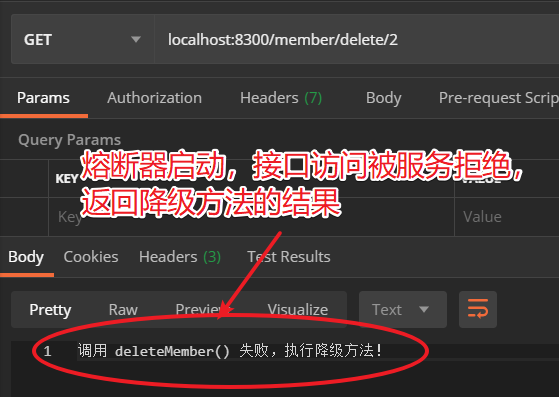
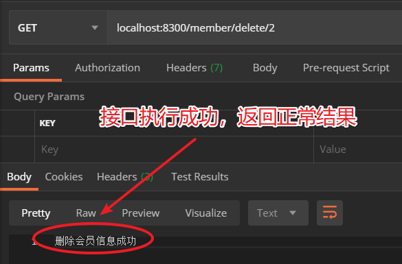

# 带你走进 SpringCloud2.0（五）：Hystrix

::: tip 背景
* 需求：在复杂的分布式系统中，保证整个系统的高可用性非常重要。
* 存在问题：服务间接口调用，可能因为调用超时、接口报错、线程池资源不足等原因，导致接口调用失败；而用户需要一直等待，也没有良好提示。这些都会导致服务的高可用性降低。
* 解决方案：SpringCloud 提供 Hystrix 解决以上的问题，保证服务的高可用性
:::

## Hystrix 介绍

::: tip Hystrix 简介
* Hystrix 组件是 SpringCloud 提供的服务保护框架。又称断路器，俗称“豪猪”，具有自我保护能力。
* Hystrix 实际是 netflix 开发的，SpringCloud 做了一个整合封装。
:::

### 雪崩效应介绍
* 雪崩效应：当一个服务的接口访问频率特别高，且该接口业务处理时间较长；当接口调用高峰期，几百个请求访问服务，直接把 web 容器的线程池消耗光，这时像访问服务的其他接口，也无法访问
  * Tomcat 服务器在接收到请求时，会从服务对应的 web 容器的线程池里申请一个线程，在线程里调用接口方法对请求进行处理，并返回结果，然后释放线程资源
  * Tomcat 的 Web 容器默认线程池数量：150。我们可以对该参数调优，比如设置为：250。当并发量大于 500，服务性能剧降，一般参数调优到 250 就不再网上增加。
  * 对服务请求并发数超过 250，可以考虑集群方案。
  * 预估服务中某些接口并发量可能会陡增，可以考虑对该这些接口进行线程隔离，可以有效保证服务的高可用。
* 连环雪崩效应：当一个服务接口要依赖其他多个服务的接口才能完成功能，这时接口并发量陡增，这也会导致调用所以来服务接口并发量陡增，这就会导致这些相关服务的接口都不能访问，这就是连环雪崩效应。

### Hystrix 保证服务高可用的 3 个技术
* 服务熔断：当一个服务在一定时间内，接口被调用失败次数达到一个阈值或百分比，会开启熔断器，在服务熔断期间，服务会拒绝客户端访问开启熔断的接口。
  * 在一个窗口时间内（默认 10000ms，即 10s）,特定接口失败请求数达到 20 （默认）个，则开启熔断器，服务拒绝客户端访问该特定接口。
  * 在一个窗口时间内（默认 10000ms，即 10s）,每个桶内统计失败请求数占总请求数累计达到 50%（默认），则开启熔断器，服务拒绝客户端访问该特定接口。
  * 熔断器开启持续时间，默认：5000ms，即 5s。
  * 熔断器持续时间到期，熔断器处于半开启状态。下一个请求成功，则关闭熔断器，成功、失败、超时、拒绝访问的请求数重新统计；下一个请求失败，则再次开启熔断器
* 请求降级：如果接口设置了降级方法，当调用接口失败、超时、拒绝访问，则会触发调用降级方法并返回结果给用户
  * 要设置正确的降级方法，否则抛出未找到降级方法的报错。
* 线程隔离：对接口另外创建线程池。对调用频率高的接口，防止该接口把 web 容器的线程池消耗光，对该接口进行线程隔离
  * 可以设置线程隔离的最大请求数，默认：10。当客户端并发调用接口数量大于最大请求数，会开启熔断器，客户端后续请求，服务直接拒绝访问；接口设置降级方法，则直接返回降级方法的友好提示给用户。
  * 对接口创建线程池，线程数默认：10。
  * 可以设置等待请求数，默认：5。当客户端发送请求并发数小于最大并发数，大于线程数，则大于 5 以内的请求会保存到内存，进入等待执行状态；大于 5 的请求，服务直接拒绝访问接口，设置降级方法，就返回降级方法的友好提示给用户。
  * 可以设置 Hystrix 超时时间，默认：1000ms，即 1s

### Hystrix 作用
* 通过线程隔离，解决雪崩效应和连环雪崩效应，保证服务的高可用。
* 通过服务熔断和接口降级，当接口调用失败、超时、被拒，能够及时返回友好提示给客户端，同时也减轻服务压力，保证服务的高可用。

:::tip 注意事项
* Hystrix 比较消耗服务器资源，所以仅给服务中并发量较高的接口开启 Hystrix 保护即可。
* Hystrix 通过 @HystrixCommand() 给接口进行增强。@HystrixCommand() 内部可以配置熔断时间等参数，@HystrixCommand() 中配置的参数会覆盖 application.yml 中配置的  Hystrix 参数。
:::

## 整合 Hystrix

* Maven 依赖
  ``` Maven
  <dependency>
      <groupId>org.springframework.cloud</groupId>
      <artifactId>spring-cloud-starter-netflix-hystrix</artifactId>
  </dependency>
  ```

* application.yml 配置
  ``` .yml
  hystrix:
  threadpool:
    default:
      ### 使用线程隔离策略的方法，创建线程池，默认：10。
      coreSize: 10
      ### 排队请求数阈值，默认：5。等请求并发数大于线程池线程数，前 5 条请求进入缓存处于等待状态；超过的请求直接返回拒绝方法报错
      queueSizeRejectionThreshold: 5
  command:
    default:
      metrics:
        rollingStats:
          ### 窗口时间，默认：10000ms，即 10s。timeInMilliseconds/numBuckets，比如：10000ms/10=10000ms，
          ### 每隔 1s 就会统计这 1s 内请求：success、failure、timeout、rejection 请求的数量
          timeInMilliseconds: 10000
          ### 桶的数量。默认：10。设置 numBuckets 的值时，保证 timeInMilliseconds % numBuckets == 0 即可
          numBuckets: 10
      circuitBreaker:
        ### 断路持续时间。默认：5000ms，即 5s
        sleepWindowInMilliseconds: 15000
        ### 窗口时间内允许接口调用报错的请求数，默认：20 个。在一个窗口时间内，一个接口调用报错次数达到 20，就开启断路器。熔断针对接口，不会触发其他接口的熔断
        requestVolumeThreshold: 5
        ### 窗口时间内允许接口调用报错占总请求数的百分比。默认：50，即 50%。每隔 bucket 内都会统计，当窗口时间内 bucket
        ### 累积：非成功请求数/总请求数 >= 50%，则会开启断路器。熔断针对接口，不会触发其他接口的熔断
        errorThresholdPercentage: 50
      execution:
        isolation:
          thread:
            ### Hystrix 接口执行超时时间，单位：ms，默认值 1s。调用接口超过超时时间，触发熔断
            timeoutInMilliseconds: 1000
          ### 最大并发请求，默认为：10 条。当该接口已经接收 10 条请求在处理，后续请求触发熔断
          semaphore:
            maxConcurrentRequests: 20
  ```
* 启动类添加注解，服务开启 Hystrix 框架的功能：@EnableHystrix

* 给接口添加 Hystrix 修饰，增强接口的高可用性。使用 @HystrixCommand() 注解。
  ``` Java
  @RestController
  public class MemberController {

      // 1. 设置回调方法；设置忽略的异常，如果是报这个异常，Hystrix 不会进行捕获并执行降级方法，接口会直接抛出异常
      @HystrixCommand(fallbackMethod = "inserMemberFallback", ignoreExceptions = {ArithmeticException.class})
      @GetMapping("/member/insert")
      public String insertMember() {
          int i = 10/0;
          return "添加会员信息成功！";
      }

      // 2.设置 commandProperties 参数，设置窗口时间内允许的错误请求阈值，错误请求百分比，熔断器持续时间配置；
      // 设置 threadPoolProperties 参数，设置线程隔离的线程池线程数，最大等待请求数
      @HystrixCommand(fallbackMethod = "deleteMemberFallback",
              commandProperties = {
                      @HystrixProperty(name = "circuitBreaker.requestVolumeThreshold", value = "5"),
                      @HystrixProperty(name = "circuitBreaker.sleepWindowInMilliseconds",value ="30000"),
                      @HystrixProperty(name = "circuitBreaker.errorThresholdPercentage",value ="60")
              })
      @GetMapping("/member/delete/{id}")
      public String deleteMember(@PathVariable("id") String id) {
          if("1".equals(id)) {
              int i = 10/0;
          }
          return "删除会员信息成功";
      }

      public String inserMemberFallback() {
          return "调用 insertMember() 失败，执行降级方法！";
      }

      public String deleteMemberFallback(String id) {
          return "调用 deleteMember() 失败，执行降级方法！";
      }

  }
  ```

## GitHub 项目 demo
::: tip
整个 demo GitHub 地址：git@github.com:ChenFengHub/springcloud-demo.git
:::

* 项目运行测试：测试 Hystrix 熔断、降级机制。
  * 先启动注册服务
  
  * 启动整合 Hystrix 的服务
  
  * 调用接口测试
    * 调用 localhost:8300/member/delete/1，传入参数为：1，接口报错；调用次数为窗口时间内触发熔断的次数。
    
    * 调用 localhost:8300/member/delete/2，传入参数不为：1，接口不会报错；发现熔断器启动，接口都是返回降级方法的返回结果；当熔断器持续时间结束，接口能够正常访问。
    
    

* [Hystrix 例子的 GitHub 地址](https://github.com/ChenFengHub/springcloud-demo/tree/master/hystrix-demo)
