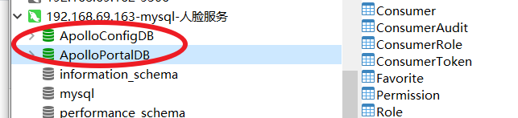
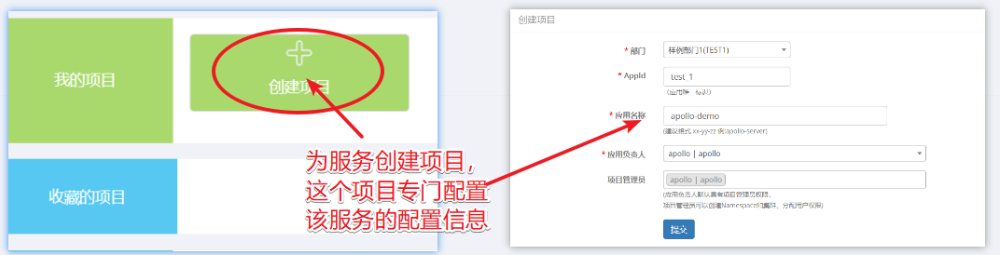
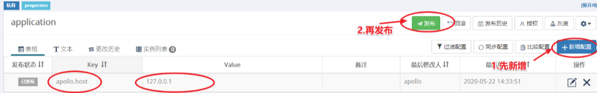

# 带你走进 SpringCloud2.0（六）：Apollo

::: tip 背景
* 在微服务发布部署过程中，子服务的数目很多，服务需要进行集群。服务配置使用配置文件存储，那样每次配置信息的修改，服务需要重新发布部署，非常繁琐。
* 分布式配置中心：微服务中较常变化的配置，放到分布式配置中心。当配置修改，分布式配置中心会将修改的配置推送给服务，服务就能实现配置的实时修改生效，服务不需要重新发布部署。
* Apollo：SpringCloud 提供的分布式配置中心 Cloud，没有管理端，使用起来很不人性化。所以我们这里改为整合 Apollo。
  * Apollo 是携程开发的分布式配置中心。
:::

## 分布式配置中心

### 分布式配置中心的组成
* 分布式配置信息持久化存储化仓库。常用的有：mysql、git。
* 分布式配置管理端。管理配置信息，进行信息的添加、编辑和修改。
* ConfigServer：保存最新配置信息。
* ClientServer：服务整合 Client 后，就认为是 ClientServer。能够通过 ConfigServer 获得变更的配置，并更新到服务对应的内存。

### 分布式配置中心的原理
* 配置管理：通过管理端，对仓库中配置信息进行操作。
* 配置消息推送：当持久化仓库中存储的配置有变更，通过消息推送机制，将修改的配置推送给 ConfigServer，ConfigServer 中始终保存着最新的配置信息。
* ClientServer 获得 ConfigServer 中修改的配置。Client 获得变更配置的常用方案：2 种
  * Client 能够与 ConfigServer 保持长连接，ConfigServer 将变更的配置实时推送给 Client。
  * Client 定时拉取 ConfigServer 中的最新配置。

## Apollo

::: tip Apollo 分布式配置中心，功能强大的一个中间件
* 它提供 4 种维度管理配置：application、environment、cluster、naspace。
* 支持发布审核：配置修改，不会生效；需要点击发布，修改的配置才会生效，推送给服务。
* 配置实时生效：配置修改，1s 以内都会推送到服务。
* 它提供配置操作的版本管理，支持回退版本。
* 权限管理：配置很重要，只有少数人有权限操作。
* 提供 RestfulApi：方便其他平台获取配置信息，方便整合 Apollo。
:::

### Apollo 组成 7 个
* 组成：ConfigService、AdminService、Client、Portal、MetaService、Eureka 和 MySQL
* ConfigService
  * 提供功能：配置的读取、推送等功能
  * 服务对象：Client。
* AdminService
  * 提供的功能：提供配置的修改、发布等功能，发布消息。会将消息推送给 ConfigService，或者由其他推送消息给 ConfigService
  * 服务对象：Portal
* Client
  * 提供的功能：定时拉取配置和接收配置修改通知等功能。SpringCloud 需要整合此，与 ConfigService 长连接。
  * 与 ConfigService 连接。Client 先要从 MetaService 获取 ConfigService 服务列表，根据负载均衡算法，选择一个 ConfigService 服务通讯。
* Portal
  * 提供的功能：Apollo 的前端管理端，可以进行项目创建，配置修改，发布等功能。
  * 调用 AdminService 服务接口，修改配置和发布通知。Portal 先要从 MetaService 获取 AdminService 服务列表，根据负载均衡算法，选择一个 AdminService 服务进行通信。
* Eureka
  * 提供的功能：作为注册中心，提供服务注册和服务发现的功能。ConfigService 和 AdminService 要注册到 Eureka。
  * Eureka 实际整合在 ConfigService 中。
* MetaService
  * 提供的功能：对外提供服务发现接口，给其他平台调用。获得 ConfigService  和 AdminService 服务信息列表；这样 Client 和 Portal 不需要注册到 Eureka，也能获取到服务信息列表。
    * MetaService 也注册到 Eureka，通过 DiscoveryClient 获取服务信息列表。
  * MetaService 实际业整合在 ConfigService 中，他们在同一个 JVM 中运行。Portal 通过连接 ConfigService 中 MetaService 获取 AdminService 服务列表信息。
* MySQL
  * 提供功能：提供配置等信息的持久化存储。

### Apollo 实现原理
* ConfigService 和 Client 保持长连接。
  * 采用 Http Long Polling 技术实现长连接。
  * 因为有长连接，所以才能实现 ConfigService 向 Client 推送配置更新通知，Client 将服务中配置修改为最新的。
  * Client 默认拉取频率：5 分钟。由于网络抖动，可能配置修改通知没有通知到 Client，Client 定时拉取最新配置，保障配置最终是一致的。
  * Client 为了保证高可用，会将每次拉取的数据在本地保存一份。当 Client 和 Config 断开连接，Client 可以使用本地的缓存文件中的配置。
  * ConfigService 默认会与 Client 保持 60s 的长连接。
    * 当 60s 内有配置更新，ConfigService 会通知客户端，将有配置变化的 namespace 告知 Client，Client 根据 namespace 拉取最新配置。
    * 当 60s 内没有配置更新，ConfigService 会给 Client 发送一个 304 状态码的消息给 Client，然后连接中断。
    * Client 只要接收到服务端的请求，都会重新发起连接。如果连接已经中断，就重新建立长连接。
* 配置发布和拉取
  * 配置发布：Portal 操作配置并发布后，ConfigService 会收到消息通知，更新配置，并将变更的配置推送给 Client。
  * 配置拉取：为了防止网络抖动，导致 Client 配置不是最新的问题，Client 会通过定时拉取 ConfigService 的配置，保证配置最终是一致的.

## Apollo 平台搭建

::: tip
* Apollo 目前仅支持 Linux 系统部署。
* 我们这里选择 CentOS7 搭建 Apollo 平台
:::

### 下载搭建 Apollo 所需的压缩包
* 包含三个压缩包：apollo-adminservice-1.6.1-github、apollo-configservice-1.6.1-github、apollo-portal-1.6.1-github。
* 将三个包放到目录： /thor/lib/apollo/ 下。

### 创建库表
* 部署 MySQL。这一步可以自己上网搜索怎么在 CentOS7 部署 MySQL。
* 创建库表
  * 执行脚本：apolloconfigdb.sql。该数据库存储我们的配置信息。
  * 执行脚本：apolloportaldb.sql。该数据库存储 Portal web 管理需要的门户信息。
  

### 解压三个包到特定目录
```command
mkdir -p /thor/lib/apollo/apollo-adminservice-1.6.1-github
mkdir -p /thor/lib/apollo/apollo-configservice-1.6.1-github
mkdir -p /thor/lib/apollo/apollo-portal-1.6.1-github
unzip -o apollo-adminservice-1.6.1-github.zip -d /thor/lib/apollo/apollo-adminservice-1.6.1-github
unzip -o apollo-configservice-1.6.1-github.zip -d  /thor/lib/apollo/apollo-configservice-1.6.1-github
unzip -o apollo-portal-1.6.1-github.zip -d  /thor/lib/apollo/apollo-portal-1.6.1-github
```

### 部署 ConfigService
* 根据不同环境，可以部署多套。这里仅部署一套，方便入门。
* ConfigService 服务中包含：ConfigService、MetaService 和 Eureka。
* 修改 apollo-configservice 启动配置
  ```command
  # 进入配置文件
  cd /thor/lib/apollo/apollo-configservice-1.6.1-github/config
  vi application-github.properties

  # 修改配置文件中数据库配置信息
  spring.datasource.url = jdbc:mysql://ip:port/ApolloConfigDB?useSSL=false  characterEncoding=utf8
  spring.datasource.username = user
  spring.datasource.password = password
  ```
* 启动服务
  ```command
  /thor/lib/apollo/apollo-configservice-1.6.1-github/scripts/startup.sh
  ```
* 默认端口：8080

### 部署 apollo-adminservice
* 根据不同环境，可以部署多套。这里仅部署一套即可，方便入门。
* 修改 apollo-adminservice 启动配置
  ```command
  # 进入配置文件
  cd /thor/lib/apollo/apollo-adminservice-1.6.1-github/config
  vi application-github.properties

  # 修改配置文件中数据库配置信息
	spring.datasource.url = jdbc:mysql://ip:port/ApolloConfigDB?useSSL=false&characterEncoding=utf8
	spring.datasource.username = user
	spring.datasource.password = password
  ```
* 启动服务
  ```command
  /thor/lib/apollo/apollo-adminservice-1.6.1-github/scripts/startup.sh
  ```
* 默认端口：8090

### 部署 apollo-portal
* 只需要部署一套即可。
* 修改 apollo-portal 启动配置。
  ```command
  # 进入配置文件
  cd /thor/lib/apollo/apollo-portal-1.6.1-github/config
  vi application-github.properties

  # 修改配置文件中数据库配置信息
  spring.datasource.url = jdbc:mysql://ip:port/ApolloPortalDB?useSSL=false  characterEncoding=utf8
  spring.datasource.username = user
  spring.datasource.password = password
  ```
* 配置 portal 连接多套 configservice 和 adminservice。portal 需要同 configservice 的 metaservice 获取 adminService 服务列表信息，再跟 adminService 通信，所以 portal 设置 configservice 连接信息即可。
  ```command
  # 进入配置文件
  cd /thor/lib/apollo/apollo-portal-1.6.1-github/config
  vi apollo-env.properties

  # 修改默认配置
  local.meta=http://localhost:8080
  dev.meta=http://localhost:8080
  fat.meta=${fat_meta}
  uat.meta=${uat_meta}
  pro.meta=${pro_meta}
  ```
* 启动服务
  ```command
  /thor/lib/apollo/apollo-portal-1.6.1-github/scripts/startup.sh
  ```
* 默认端口：8070
* 默认用户/密码：apollo/admin

## 整合 Apollo

### 创建项目应用
* 在 Apollo Portal 管理端里创建项目，专门用于配置对应服务的配置。
* 我们这里为 apollo-demo 服务创建 test_1 项目
  

### client 打包
* client 需要通过源码打包到我们本地仓库，引用本地仓库中对应的 Maven 包，即可整合 client。
* 打包方式有 2 种
  * 统一打包：进入源码的 scripts/ 目录下，点击 build.bat，即可将全部包都打到本地仓库。
  * 单一打包：通过 idea  maven 一个个包的打。

### Maven 依赖
* Client Maven 依赖时上一步打到本地 Maven 仓库。
* Maven 依赖如下
  ```Maven
  <dependency>
    <groupId>com.ctrip.framework.apollo</groupId>
    <artifactId>apollo-client</artifactId>
    <version>1.1.0</version>
  </dependency>
  <dependency>
    <groupId>com.ctrip.framework.apollo</groupId>
    <artifactId>apollo-core</artifactId>
    <version>1.1.0</version>
  </dependency>

  <dependency>
      <groupId>org.projectlombok</groupId>
      <artifactId>lombok</artifactId>
      <scope>provided</scope>
  </dependency>
  ```

### application.yml 配置
  ```.yml
  app:
    ### portal 中新建 Application 的 AppId
    id: test_1
  apollo:
    ### configserver 的地址
    meta: http://{configserver.host}:8080
  ```

### 启动类添加注解
* 开启 Client 框架功能
  ```Java
  @EnableApolloConfig
  ```

### 配置类获取配置
* 使用 @Value() 获取配置。@Value() 使用时，最好设置默认值：@Value("${value:默认值}")
* 代码
  ```Java
  @Data
  @Component
  public class ApplicationConfig {

      @Value("${apollo.host:default}")
      private String apolloHost;

  }
  ```

### 控制层提供接口获取配置
* 操作 Apollo 的 Portal 添加配置并发布。
  
* 通过接口获取配置，看看配置是否实时更新。
* 代码
  ```Java
  @RestController
  public class ConfigController {

      @Autowired
      private ApplicationConfig applicationConfig;

      @GetMapping("/config/get")
      public String getConfigValue() {
          return applicationConfig.getApolloHost();
      }

  }
  ```
* 测试接口，获得最新配置。每次 Portal 修改并发布配置参数信息，我们客户端能够实时获得更新
  

## GitHub 项目 demo

* [整个 demo GitHub 地址](https://github.com/ChenFengHub/springcloud-demo )

* [Apollo 例子的 GitHub 地址](https://github.com/ChenFengHub/springcloud-demo/tree/master/apollo-demo)
