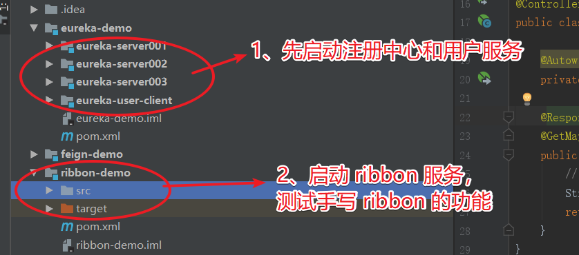

::: tip 背景
* Ribbon：SpringCloud 的微服务中接口之间的相互调用时，服务根据拉取到本地的服务注册信息列表，以及 serverId 及轮询算法，选择一个服务的地址信息，组合成调用接口的完整信息，完成接口的调用。Ribbon 就完成了以上的功能。
* Ribbon 实现了本地负载均衡。
:::

## Ribbon 介绍

::: tip Ribbon 简介
* Ribbon 组件是 SpringCloud 提供的本地负载均衡解决方案。
* Ribbon 实际是 netflix 开发，SpringCloud 仅做整合封装。
* Ribbon 主要实现了本地负载均衡的功能。
:::

### Ribbon 实现原理
* Ribbon 会在服务启动时，将注册服务信息列表拉取到本地，存储在 JVM 的内存中。
* 当服务根据 serverId + url 方式调用接口时，会根据 serverId 从服务信息列表中取得对应服务列表信息（服务可能集群）。
* 再根据轮询算法，通过取模：服务总请求数 % 服务集群数，选取一个服务信息。
* Ribbon 封装了 HTTPClient，调用接口并返回结果。

### 本地负载均衡和服务端负载均衡区别
* 本地负载均衡：服务将注册的服务信息列表拉取到本地，服务自己通过轮询等算法，选取服务列表中某个服务地址信息，然后调用接口，这就叫本地负载均衡。核心是服务自己实现负载均衡。
* 服务端负载均衡：服务不获取注册服务信息列表，直接将请求发送给 nginx 等反向代理服务器，由 nginx 实现负载均衡，选择目标服务并发送请求，这就叫服务端负载均衡。核心是服务自己不实现负载均衡，由其他服务器实现负载均衡。

## 整合 Ribbon
* SpringCloud 默认整合了 Ribbon，不需要进行额外的整合 maven 依赖，不需要注解开启 Ribbon 框架的功能。
* Ribbon 可以在 application.yml 中配置超时时间，本质是设置 HTTPClient 的超时时间。
  ```.yml
  ribbon:
    ### 连接超时时间，默认：1000，单位：ms
    ConnectTimeout: 5000
    ### 读取超时时间，默认：1000，单位：ms
    ReadTimeout: 5000
  ```

## 纯手写 Ribbon
::: tip
* SpringCloud 中通过 DiscoveryClient 对象获取注册的服务信息列表。
* SpringCloud 通过 Feign 或 RestTemplate 调用接口时，底层默认整合 Ribbon 实现调用接口，所以我们使用 SpringCloud 调用其他微服务接口，不需要特意整合 Ribbon。这里纯手写 Ribbon 只是为了方便理解 Ribbon 的实现原理。
:::

* maven 依赖
  ```Maven
  <dependency>
      <groupId>org.springframework.boot</groupId>
      <artifactId>spring-boot-starter</artifactId>
  </dependency>

  <dependency>
      <groupId>org.springframework.boot</groupId>
      <artifactId>spring-boot-starter-web</artifactId>
  </dependency>

  <dependency>
      <groupId>org.springframework.cloud</groupId>
      <artifactId>spring-cloud-starter-netflix-eureka-client</artifactId>
  </dependency>

  <!-- 使用 HttpClient -->
  <dependency>
      <groupId>org.apache.httpcomponents</groupId>
      <artifactId>httpclient</artifactId>
      <version>4.5.5</version>
  </dependency>
  ```
* 代码
  ```Java
  @Component
  public class MyRibbon {
      @Autowired
      private DiscoveryClient discoveryClient;
      private Map<String, AtomicInteger> reqCountMap = new ConcurrentHashMap<>();

      /** 采用双重检查加锁的方式，创建 reqCount 对象，保证不出现线程安全问题，同时能较快创建对象 **/
      private AtomicInteger getRegCount(String serverId) {
          AtomicInteger reqCount = reqCountMap.get(serverId);
          if (reqCount == null) {
              synchronized (reqCountMap) {
                  reqCount = reqCountMap.get(serverId);
                  if(reqCount == null) {
                      reqCount = new AtomicInteger(-1);
                      reqCountMap.put(serverId, reqCount);
                  }
              }
          }
          return reqCount;
      }

      /**
      * 获取服务列表，并通过负载均衡选择一个服务地址返回
      **/
      private String getInstances(String serverId) {
          List<ServiceInstance> instances = discoveryClient.getInstances(serverId);
          if (instances == null || instances.size() == 0) {
              return null;
          }
          // 1. 服务集群总数
          Integer serverCount = instances.size();
          // 2. 轮询算法：通过总请求数与服务集群总数进行取模
          AtomicInteger reqCount = getRegCount(serverId);
          Integer serviceIndex = reqCount.addAndGet(1) % serverCount;
          return instances.get(serviceIndex).getUri().toString();
      }

      private String doGet(String url) {
          // 获得Http客户端(可以理解为:你得先有一个浏览器;注意:实际上HttpClient与浏览器是不一样的)
          CloseableHttpClient httpClient = HttpClientBuilder.create().build();
          // 创建Get请求
          HttpGet httpGet = new HttpGet(url);

          // 响应模型
          CloseableHttpResponse response = null;
          try {
              // 由客户端执行(发送)Get请求
              response = httpClient.execute(httpGet);
              // 从响应模型中获取响应实体
              HttpEntity responseEntity = response.getEntity();
              System.out.println("响应状态为:" + response.getStatusLine());
              if (responseEntity != null) {
                  String res = EntityUtils.toString(responseEntity);
                  System.out.println("响应内容长度为:" + responseEntity.getContentLength());
                  System.out.println("响应内容为:" + res);
                  return res;
              }
          } catch (Exception e) {
          } finally {
              try {
                  // 释放资源
                  if (httpClient != null) {
                      httpClient.close();
                  }
              } catch (IOException e) {
                  e.printStackTrace();
              }
          }
          return "error";
      }

      /**
      * 模拟 Ribbon 调用接口
      * @param serverId
      * @param url
      * @return
      */
      public String ribbonGet(String serverId, String url) {
          // 1.获取服务名称对应服务列表
          String host = getInstances(serverId);
          if (host == null) {
              return "No instances available for zookeeper-member-server";
          }
          url = host + url;
          String res = doGet(url);
          return res;
      }

  }
  ```

## GitHub 项目 demo

* [整个 demo GitHub 地址](https://github.com/ChenFengHub/springcloud-demo )

* 项目运行测试：需要先启动上节介绍的注册中心和用户服务，然后再启动 ribbon 服务，调用 http://8101/ribbon/test 进行测试

* [手写 Ribbon 例子的 GitHub 地址](https://github.com/ChenFengHub/springcloud-demo/tree/master/ribbon-demo)
