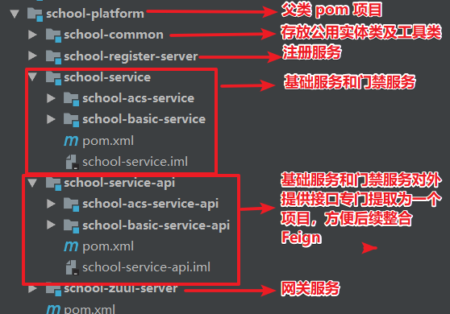
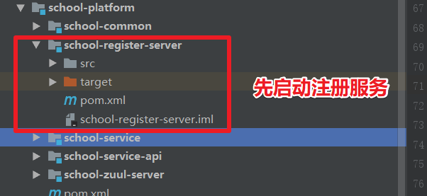
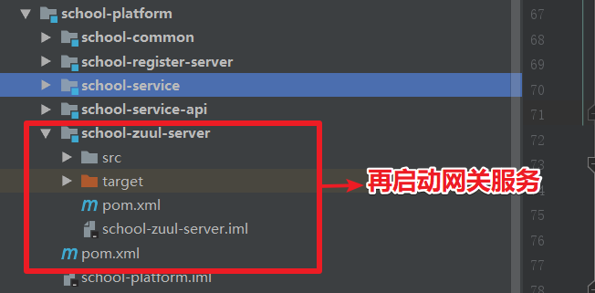
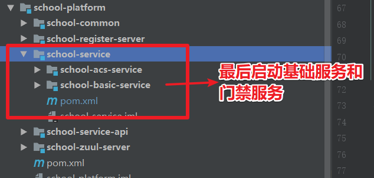

::: tip 背景
终于，我们将 SpringCloud2.0 常用组件介绍完成，我们对 SpringCloud2.0 也已经有了一个初步的了解，现在我们通过一个的案例，对 SpringCloud2.0 各种组件实现一个整合，搭建一个基本可用的实例。
:::

## 案例设计思路

### 案例简介
* 开发一个学校信息管理平台的案例，主要服务划分为：注册服务、网关服务、基础服务和门禁服务。

### 服务划分思路
* 在微服务开发过程中，我们需要将功能相近的业务划分为一个专门的服务，以提供接口给其他服务调用。所以我们将用户信息、角色信息、学生信息等共享的信息放到基础信息服务；将门禁相关的划分为门禁服务。
* 每个服务有自己独立的数据库。
  * 注：服务划分最难的就是数据库边界的确定，一定要避免出现不同的服务之间出现联表查询，否则只能说明服务划分不成功。

### 各个服务功能简介
* 注册服务
  * 提供服务注册和服务发现功能。
* 网关服务
	* 路由转发：我们在实际项目中可能不只基础信息服务和门禁服务，可能还有 n 多个服务，所以我们需要一个统一入口调用接口。
	* 整合 Apollo 实现动态路由功能。
	* 可以进行权限的统一验证。该功能一般需要整合 Redis 作为分布式 session，所以我们为了简便，不做介绍。
* 基础服务
	* 提供学生信息接口。
* 门禁服务
	* 通过 Feign 调用基础服务的学生信息接口。基础服务将接口提取为一个专门的服务包，方便整合 Feign。
	* 提供生成门禁刷卡的接口。
	* 提供查询门禁刷卡的接口。假设该接口要被许多 PC 端和 APP 端查询，QPS 比较高，我们通过整合 Hystrix 保证接口的高可用性。

## GitHub 项目 demo

* [整个 demo GitHub 地址](https://github.com/ChenFengHub/springcloud-demo )

* 项目目录结构简介

  

* 项目运行测试
  * 先启动注册服务

	

	* 再启动网关服务

	

	* 再启动基础服务和门禁服务

	

* [学校信息管理平台例子的 GitHub 地址](https://github.com/ChenFengHub/springcloud-demo/tree/master/school-platform)
