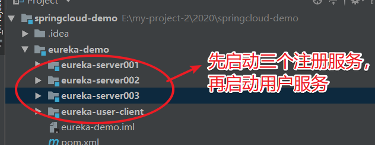
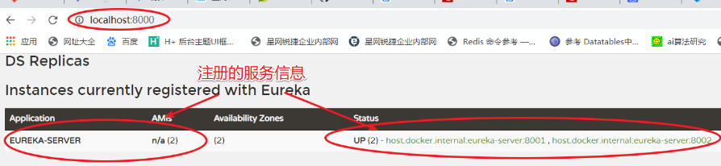

::: tip 背景
* 需求：当服务之间的依赖关系非常复杂时，我们需要服务治理功能，实现对服务之间依赖关系的管理。
* 微服务架构要解决的首要问题就是服务治理。我们通过注册中心来实现服务治理功能。
* 注册中心主要实现两个功能：服务注册和服务发现。
  * 服务注册：将服务信息注册到注册中心。
  * 服务发现：从注册中心获取注册服务信息列表。
* 方案：SpringCloud 提供 Eureka 注册中心，解决服务之间依赖关系难以管理的问题。
:::

## 注册中心

### 注册中心实现原理
* 注册中心也是一个服务。注册中心会保存其他服务信息，以 serviceId 和 value 形式保存服务信息。
  * serviceId 保存的是服务名称。
  * value 保存的是服务 ip + port  列表。因为服务集群时，一个 serviceId 会对应多个服务信息，所以用列表存储服务信息。
* 注册中心与其他服务建立心跳，定时将过期的服务信息从注册中心剔除。
* 服务定期从注册中心拉取最新的注册服务信息列表。

## Eureka 介绍

::: tip Eureka 简介
* Eureka 组件是 SpringCloud 提供的注册中心解决方案。
* Eureka 实际是 netflix（美国知名视频网站） 开发的，SpringCloud 做了一个整合封装。
:::

### Eureka 实现原理
* Eureka 主要分为：Eureka server 和 Eureka client。
* 注册中心：服务整合 Eureka server 的服务就是注册中心服务。
* 需要注册的服务：服务整合 Eureka client 就是需要注册的服务
* 服务与注册中心会保持心跳；服务会将自己的信息注册到注册中心；服务可以从注册中心拉取注册服务信息列表
* 服务心跳默认间隔：30s

### 服务保护机制
* 作用：防止注册的服务信息误剔除，所以注册中心会默认开启服务保护机制
* 服务保护机制几个配置的作用
  * 剔除服务时间间隔，默认：60s。服务每过剔除时间间隔，会将失效的服务信息从注册中心剔除
  * 服务默认保护时间：15 分钟，
  * 续约阈值默认：0.85。即一个服务在剔除服务时间间隔检查时，需要进行多少次续约，没达标不会马上将服务信息剔除。服务会进入保护状态，在保护时间 15 分钟内，有心跳上来，则认为服务正常，退出保护状态；服务保护时间内都没有心跳上来，在剔除服务时间间隔点检查服务信息是否失效时，将这些服务信息从注册中心剔除。
    * 需要进行的续约次数：（剔除时间间隔/心跳间隔）* 0.85。次数没有大于等于计算值，会认为服务心跳数目不达标。0.85 这个值略高，可能经常触发服务保护，推荐设置：0.5。
    * 服务保护机制的必要性：因为网络抖动等情况，可能导致心跳次数不达标，而不是服务本身出现问题，为了防止注册的服务信息误删除，服务保护机制就应运而生。

## 整合 Eureka

### 父 pom 的 maven 依赖
  ``` maven
  <dependencyManagement>
      <dependencies>
          <dependency>
              <groupId>org.springframework.cloud</groupId>
              <artifactId>spring-cloud-dependencies</artifactId>
              <!-- SpringBoot2.0.1 对应 SpringCloud 是 Finchley.RELEASE；SpringBoot2.1.1 以上，对应的SpringCloud是Greenwich.RELEASE-->
              <!-- <version>Finchley.RELEASE</version>-->
              <version>Greenwich.RELEASE</version>
              <type>pom</type>
              <scope>import</scope>
          </dependency>
      </dependencies>
  </dependencyManagement>
  <!-- 注意：这里必须要添加，否则各种依赖有问题 -->
  <repositories>
      <repository>
          <id>spring-milestones</id>
          <name>Spring Milestones</name>
          <url>https://repo.spring.io/libs-milestone</url>
          <snapshots>
              <enabled>false</enabled>
          </snapshots>
      </repository>
  </repositories>
  ```
### 整合 eureka server
* Eureka server 的 maven 依赖
   ```maven
  <!-- SpringBoot 整合 Eureka 服务端 -->
  <dependency>
    <groupId>org.springframework.cloud</groupId>
    <artifactId>spring-cloud-starter-netflix-eureka-server</artifactId>
  </dependency>
   ```
* application.yml 中的配置
  ```.yml
  ### 服务端口
  server:
    port: 8000
  spring:
    application:
      ### 服务名称
      name: eureka-server
  eureka:
    instance:
      ### 域名。最好设置成本机 ip，如果设置的域名，在服务器域名列表中不能映射到真实 ip，会导致通信异常
      hostname: 127.0.0.1
      ### 开启 ip 配置，默认：false-不开启。我们正常使用 hostname 即可
      prefer-ip-address: true
      ### 开启 ip 后，这里需要配置服务器真实 ip
      ip-address: 127.0.0.1
    server:
      ### 是否开启自我保护机制。默认：true-开启。
      ### 自我保护机制是为了防止服务不是由于自身问题，而是网络抖动，无法及时续约，导致服务信息被误剔除的问题
      enable-self-preservation: true
      ### 自我保护时间（续约阈值更新间隔）。默认：900000ms即 900s/15分钟。
      renewal-threshold-update-interval-ms: 90000
      ### 续约百分比阈值。默认：0.85。
      ### 查看每分钟续约的服务次数是否达到 85%，未达到，进入自我保护，当 15分钟内有服务续约则不剔除服务，否则剔除服务
      renewal-percent-threshold: 0.85
      ### 剔除间隔时间，默认：60s。每间隔 60s，会判断每个服务是否要被剔除，如果服务超过服务保护时间还没续约，就剔除
      eviction-interval-timer-in-ms: 60000
    client:
      service-url:
        ### 注册服务集群，要相互注册。目前有三个注册服务，端口分别为：8000,8001,8002，我们服务需要注册到其他注册中心上
        defaultZone: http://${eureka.instance.ip-address}:8001/eureka/, http://${eureka.instance.ip-address}:8002/eureka/
      ### 是否注册到注册中心，默认：true-注册。我们服务集群时，需要注册到注册中心；单独一个注册中心，不推荐注册到注册中心
      register-with-eureka: false
      ### 是否拉取注册中心服务列表信息，默认：true-拉取。最好开启，不然 eureka 网页端，看不到任何服务的信息
      fetch-registry: true
      ### 拉取服务列表的时间间隔，默认：30s
      registry-fetch-interval-seconds: 30
  ```
* 启动类添加注解，服务开启 Eureka Server 功能：@EnableEurekaServer

### 整合 Eureka client
* Eureka client 的 maven 依赖
   ```maven
  <!-- SpringBoot 整合 Eureka 服务端 -->
  <dependency>
    <groupId>org.springframework.cloud</groupId>
    <artifactId>spring-cloud-starter-netflix-eureka-client</artifactId>
  </dependency>
   ```
  * application.yml 中的配置
  ```.yml
  server:
    port: 8100
  spring:
    application:
      name: user-server
  eureka:
    instance:
      prefer-ip-address: true
      ip-address: 127.0.0.1
      ### 客户端续约时间，默认：30s
      lease-renewal-interval-in-seconds: 30
      ### 发呆时间，默认：90s
      lease-expiration-duration-in-seconds: 90
    client:
      service-url:
        defaultZone: http://${eureka.instance.ip-address}:8000/eureka/,http://${eureka.instance.ip-address}:8001/eureka/,http://${eureka.instance.ip-address}:8001/eureka/
  ```
* 启动类添加注解，服务开启 Eureka Client 功能：@EnableEurekaClient

## GitHub 项目 demo

* [整个 demo GitHub 地址](https://github.com/ChenFengHub/springcloud-demo )

* 项目运行测试：将三个注册服务启动，然后启动用户服务；进入注册服务管理端：http://localhost:8000，查看注册信息
  * 启动服务
  

	* 进入注册服务管理端
  

* [注册中心和用户服务例子的 Github 地址](https://github.com/ChenFengHub/springcloud-demo/tree/master/eureka-demo)
