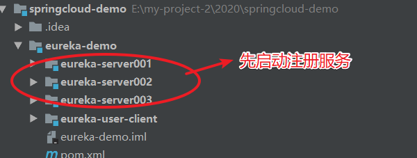
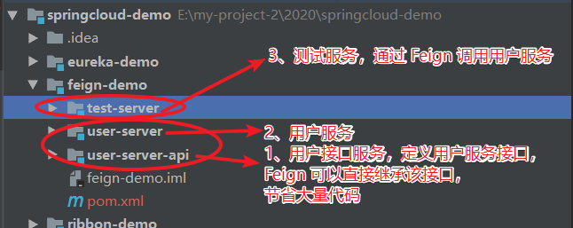

::: tip 背景
* SpringCloud 为了简化调用其他微服务接口的代码，提供了专门的 rpc 调用框架。
* SpringCloud 有 2 种 rpc 远程调用方式：RestTemplate 和 Feign。两者都整合了 Ribbon。
* RestTemplate 有 2 中方式调用接口
  * 通过 host + url 调用接口，这种方式不需要整合 Ribbon，是通过 HTTPClient 进行服务间接口调用；
  * 通过 serverId + url 调用接口，这种方式需要整合 Ribbon。
* Feign 是 SpringCloud 微服务中接口调用的主流方案。因为 Feign 相对于 RestTemplate，可以更大程度简化调用接口代码，并且可以设置降级方法，当接口调用失败，给用户友好提示。
:::

## Feign 介绍
::: tip Feign 简介
* Feign 组件是一个声明式接口调用框架。其内置了 Ribbon 和 Hystrix，可以进行本地负载均衡调用接口和服务保护。
* Feign 实际是 netflix 开发，SpringCloud 仅做整合封装。
* Feign 主要作用就是极度简化了调用其他服务接口所需的代码。
:::

### Feign 实现原理
* Feign 通过整合 Ribbon，实现本地负载均衡调用接口。所以设置 Feign 调用超时和连接时间，本地是设置 Feign 的超时。
  ```.yml
  ribbon:
    ###创建连接超时时间，默认：1s，单位：ms。
    ConnectTimeout: 5000
    ###创建连接后从服务器读取到可用资源所用的时间，默认：1s，单位：ms。
    ReadTimeout: 5000
  ```
* Feign 整合 Hystrix，保证调用接口的高可用性。默认 Feign 是不开启 Hystrix 的，需要开启
  ``` .yml
  feign:
    hystrix:
      enabled: true
  ```

### Feign 基本用法
* Feign 要配和 @FeignClient 注册使用，配置该接口访问 serverId，再配置接口调用失败，执行的降级方法
  * 我们在设计接口，如果将接口专门设计为一个项目，打成 jar 包，这样 Feign 使用的时候，直接实现接口即可，可以极大简化调用第三方
  * 代码
  ``` Java
  @FeignClient(value = "user-server", fallback = UserFallback.class)
  public interface UserServiceFeign extends IUserService {
  }
  ```
* 降级类要继承 Feign 接口，并通过 @Component 注入 Spring 容器
  ``` Java
  @Component
  public class UserFallback implements UserServiceFeign {
      @Override
      public String getUserInfo() {
          System.out.println("人员信息不存在！");
          return null;
      }
  }
  ```

## 整合 Feign

* maven 依赖
  ``` Maven
  <dependency>
    <groupId>org.springframework.cloud</groupId>
    <artifactId>spring-cloud-starter-openfeign</artifactId>
  </dependency>
  ```

* application.yml 配置
  ``` .yml
  ribbon:
    ###创建连接超时时间，默认：1s，单位：ms。
    ConnectTimeout: 5000
    ###创建连接后从服务器读取到可用资源所用的时间，默认：1s，单位：ms。
    ReadTimeout: 5000
  ### 默认值：false-未开启。feign 开启请求熔断，未开启，只会报 Socket 超时错误，不会执行降级方法
  feign:
    hystrix:
    enabled: true
  ```

* 启动类添加注解，服务开启 Feign 框架的功能：@EnableFeignClients

* Feign 声明式接口的使用
  * UserServiceFeign 继承接口类 IUserService。设置降级类为：UserFallback。
    ``` Java
    public interface IUserService {
        @RequestMapping(value = "/user/get")
        String getUserInfo();
    }
    /** value 是调用接口的服务名称 **/
    @FeignClient(value = "user-server", fallback = UserFallback.class)
    public interface UserServiceFeign extends IUserService {
          // 继承 IUserService，里面的接口定义不需要在 Feign 接口中重写一遍，省略了代码
    }
    ```
  * 降级类：UserFallback，该类实现 Feign 接口且注入 Spring 容器
    ``` Java
    @Component
    public class UserFallback implements UserServiceFeign {
      @Override
      public String getUserInfo() {
        System.out.println("人员信息不存在！");
        return null;
      }
    }
    ```
## GitHub 项目 demo

* [整个 demo GitHub 地址](https://github.com/ChenFengHub/springcloud-demo )

* 项目运行测试：测试 Feign 接口调用其他服务的接口的功能。
  * 先启动注册服务
  
  * 启动用户服务和测试服务。测试服务整合 Feign，Feign 调用用户服务接口
  

* [Feign 例子的 GitHub 地址](https://github.com/ChenFengHub/springcloud-demo/tree/master/feign-demo)
